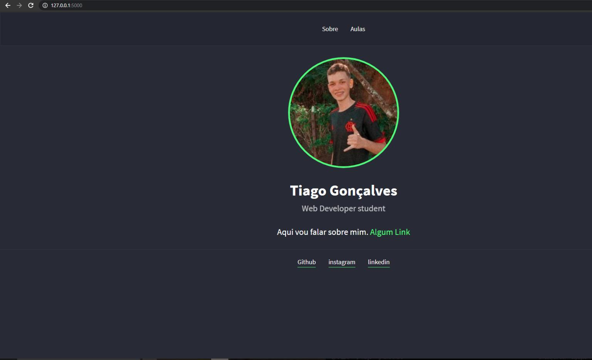
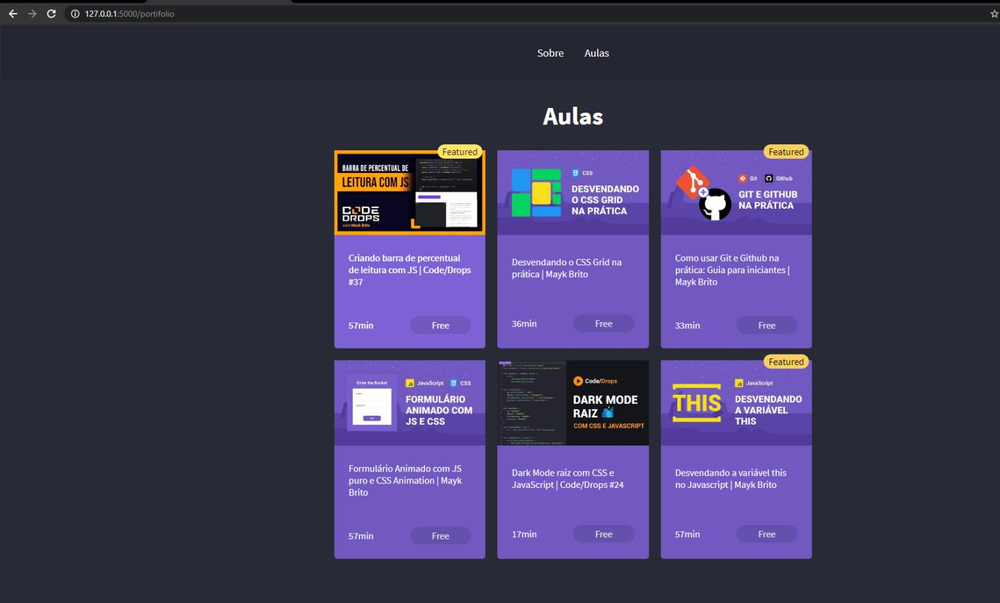
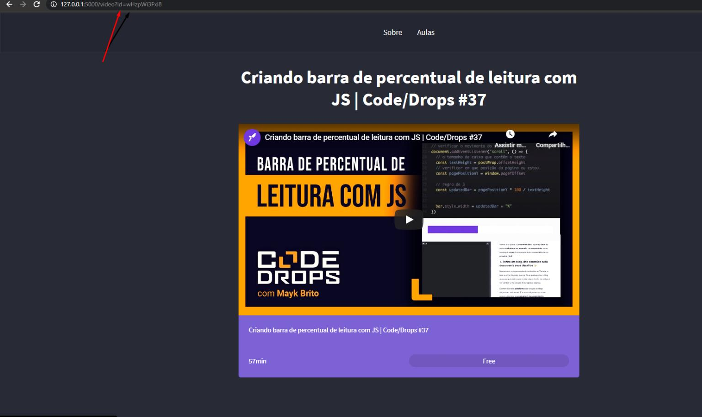

<h2 align="center">LauchBase da Rocketseat - Modulo 2e3</h2>

___

s
<h3 align="center">
  <a href="#information_source-sobre">Sobre</a>&nbsp;|&nbsp;
  <a href="#interrobang-motivo">Motivo</a>&nbsp;|&nbsp;
  <a href="#seedling-requisitos-mínimos">Requisitos</a>&nbsp;|&nbsp;
  <a href="#rocket-tecnologias-utilizadas">Tecnologias</a>&nbsp;|&nbsp;
  <a href="#link-como-contribuir">Como Contribuir</a>&nbsp;|&nbsp;
</h3>

___

## :information_source: Sobre

Projeto portífolio desenvolvido nos modulos 2 e 3 do LauchBase da Rocketseat na qual tem página Sobre, outra para adicionar algo, neste caso foi vídeos, e na 3° página será reproduzido o vídeo.

## :interrobang: Motivo

O motivo de ser feito é para colocar em prática os conhecimentos obtidos das tecnologias mais atuais.  

## :rocket: Tecnologias Utilizadas 

O projeto foi desenvolvido utilizando as seguintes tecnologias

- HTML
- CSS
- JavaScript
- NodeJs

## :busts_in_silhouette: Minhas redes Sociais

<a href="https://www.linkedin.com/in/tiagogoncalves200428/ target='_blank'">- Linkedin</a>

<a href="https://www.instagram.com/tg001_xx/ target='_blank'">- Intagram</a>

## :link: Como contribuir 

- Faça um Fork do repositório
- Clone o seu repositório
- Crie uma branch com a sua feature
- Faça um commit com suas mudanças
- 'Push' a sua branch
- Ir em Pull Requests do projeto original e criar uma pull request com o seu commit
